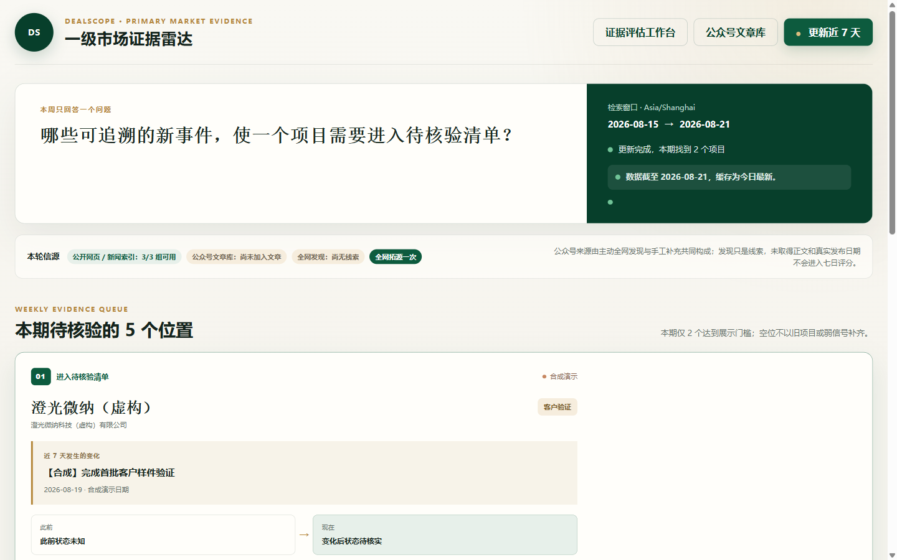
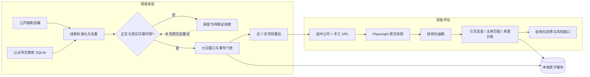

# DealScope｜一级市场证据雷达

> **中文：** 一个把公开搜索线索、原文证据与结构化初筛严格分开的本地优先研究工作流。<br>
> **English:** An evidence-first, local-first workflow that keeps public-search leads, source documents, and structured screening strictly separated.

`Python 3.12` · `Flask` · `SQLite` · `Playwright` · `Docker` · `114 automated tests`

DealScope 面向一级市场项目初筛。它不尝试“自动给出投资答案”，而是先回答两个更可审计的问题：**最近发生了什么？现有材料足以支持哪些判断？**

> 仓库内的演示公司、公众号、事件、引文和 URL 均为纯合成数据。它们不对应任何真实主体，也不构成投资建议。

## 在线体验

**[打开 DealScope 真实 Flask 在线工作台 →](https://dealscope-evidence-radar-production.up.railway.app/)**

在线体验运行仓库中的真实 Flask 页面、路由与数据标准化逻辑，不是重新仿制的静态页面。周度雷达与证据评估工作台通过同一域名连接；“更新近 7 天”会实际查询无凭据公开 RSS，并把真实名称、日期和来源作为 `discovery_only / 待核验` 线索展示。全局刷新冷却避免匿名滥用；个人登录态、公众号历史文件、任意 URL 抓取和写操作仍只保留在本地完整版。



## 3 分钟了解项目

### 问题

公开搜索很适合发现线索，却不天然等于证据：标题可能是旧闻，抓取时间可能被误当事件时间，同一文章被多个搜索引擎命中也可能被误算为“多源确认”。这些错误一旦进入评分，界面越精致，结论反而越危险。

### DealScope 做什么

- **近 7 天项目变化雷达**：只展示窗口内可指认的新变化；不足 5 个时保留空位，不用旧项目凑数。
- **候选公司深度评估**：保存原文快照，反查逐字引文，区分事实、推断和待核实项，再进行结构化初筛。
- **公众号文章库**：支持公开网页主动发现、手工 URL 与历史文件导入；未取得正文和真实发布日期的文章不会进入七日评分。
- **本地优先运行**：两个 Flask 服务只监听 loopback，研究数据、缓存和凭据边界均留在本机。

## 证据契约

| 状态 | 必须满足 | 可以进入正式评分？ |
|---|---|---:|
| 线索 `discovery_only` | 只在搜索标题或摘要中发现 | 否 |
| 已读原文 | 已保存来源页面正文与最终 URL | 仍需按字段判断 |
| 引文匹配 | 报告引文可在保存原文中逐字找到 | 是，但仅支持该项事实 |
| 主体匹配 | 引文明确指向目标公司或法定主体 | 是 |
| 独立确认 | 不同原始来源支持同一项具体事实 | 可提高置信度 |
| 人工复核 | 分析人员确认日期、主体与语义 | 可进入正式材料 |

额外门禁：抓取时间不能代替事件或发布日期；多检索渠道命中不等于独立互证；抽取失败不会生成正向替代证据；更新失败不会覆盖上一次成功报告。

详见 [证据契约](docs/EVIDENCE_CONTRACT.md)。

## 架构



模块责任和数据流见 [架构说明](docs/ARCHITECTURE.md)。

## 快速启动

### 1. 安装

需要 Python 3.12。首次安装 Playwright 浏览器会下载 Chromium。

```bash
python -m venv .venv
```

Windows PowerShell：

```powershell
.\.venv\Scripts\Activate.ps1
python -m pip install -r requirements.txt
python -m playwright install chromium
```

macOS / Linux：

```bash
source .venv/bin/activate
python -m pip install -r requirements.txt
python -m playwright install chromium
```

### 2. 载入安全演示数据

```bash
python scripts/load_demo.py
```

脚本只会从 `examples/` 读取带有 `synthetic: true` 标记的模板，并在 `data/output/` 生成合成缓存；不会联网，也不会读取真实研究数据。若目标位置已有非合成报告，脚本会拒绝覆盖，除非显式使用 `--force`。

### 3. 启动两个本地页面

终端一：

```bash
python app/radar_app.py
```

终端二：

```bash
python app/app.py
```

- 周度雷达：<http://127.0.0.1:8791/>
- 深度评估：<http://127.0.0.1:8787/>

演示说明见 [Synthetic Demo](docs/DEMO_DATA.md)。外部搜索或 LLM 提供方均为可选能力；未配置时仍可查看合成演示、运行测试和使用手工 URL 工作流。

公众号原文的第三方公开正文回退默认关闭。只有在确认可以把该公开文章 URL 发送给外部服务后，才显式设置 `DEALSCOPE_ALLOW_PUBLIC_WECHAT_FALLBACK=1`；不设置时系统只尝试直接读取原文。

## 测试

```bash
python -m unittest discover -s tests -v
```

当前测试集共 **114 项**，重点覆盖“错误信息不能越过证据边界”，包括：

- 搜索摘要、未来日期和抓取时间不得制造时效性证据；
- 私网地址、危险重定向、非文本与超大响应必须被拒绝；
- LLM/CLI 失败不得生成正向 fallback；
- 旧缓存、刷新失败和演示报告必须被明确隔离；
- 公众号导入去重、凭据字段过滤、事务写入与主动发现来源必须可追溯。

## 可靠性与安全

- 服务仅绑定 `127.0.0.1`，写操作检查本地来源。
- URL 抓取会校验协议、主机、DNS 解析与每次重定向，降低 SSRF 风险。
- 报告和正文缓存采用同目录临时文件与原子替换；失败时保留最近一次成功结果。
- 公众号文章库使用 SQLite 事务，并对白名单字段入库；cookie、token、password 等凭据字段不会写入文章表。
- 页面显示数据截至时间、缓存龄期和最近刷新错误；“发现”始终与“证据”分开。
- 合成演示使用 IANA 保留的 `.invalid` 域名，不指向真实网站。

更多说明见 [安全与隐私](docs/SECURITY_AND_PRIVACY.md)。

## 仓库结构

```text
app/                         两个本地 Flask 工作台
collectors/                  浏览器采集与可选登录态
config/                      搜索与评分配置
examples/                    纯合成 JSON 模板
scripts/load_demo.py         安全演示缓存生成器
tests/                       证据、网络、缓存与 UI 边界测试
weekly_radar.py              七日事件筛选与刷新编排
wechat_source_pool.py        公众号 SQLite 文章库
wechat_discovery.py          可插拔公开搜索发现层
score_engine.py              结构化初筛与置信度诊断
```

## 已知限制

- 公开搜索覆盖取决于配置的提供方，不代表完整互联网或完整公众号历史。
- 公司实体归一化与事件识别包含启发式规则，仍需要人工复核。
- 结构化评分用于研究排序，不是收益预测，也未经过投资回报回测。
- 当前定位是本地单用户研究工具，不是多租户生产 SaaS。
- 部分受登录、验证码或反爬限制的页面可能无法自动取得正文。
- 任何 LLM 输出都必须经过原文引文反查，不能单独作为事实来源。

## 隐私与非投资建议

DealScope 不要求上传本地研究资料。请勿将 cookie、token、二维码凭据、未公开项目材料或受限制内容提交到公开仓库。公开云端刷新只连接程序内置的无凭据 RSS 查询，结果始终停留在“公开线索 / 待核验”；需要正文、公众号历史或登录态的流程仍在本地运行。`examples/` 中的深度评估样例继续使用纯合成数据。

本项目用于展示证据优先的研究软件工程方法，不提供证券、基金、股权投资或其他金融产品的投资建议，不替代立项、尽调、合规审查和投资决策。

## License

当前公开作品集未授予开源许可证；在代码权属与许可范围确认前，默认保留全部权利。
